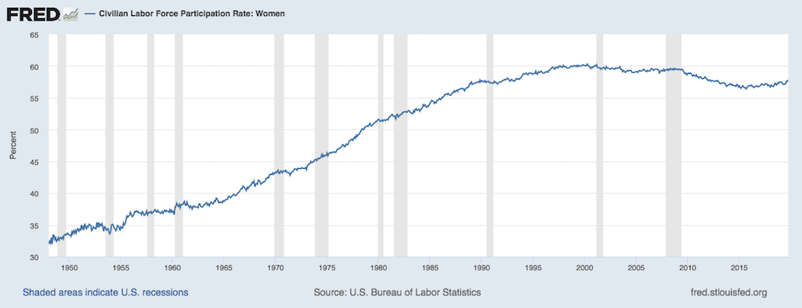
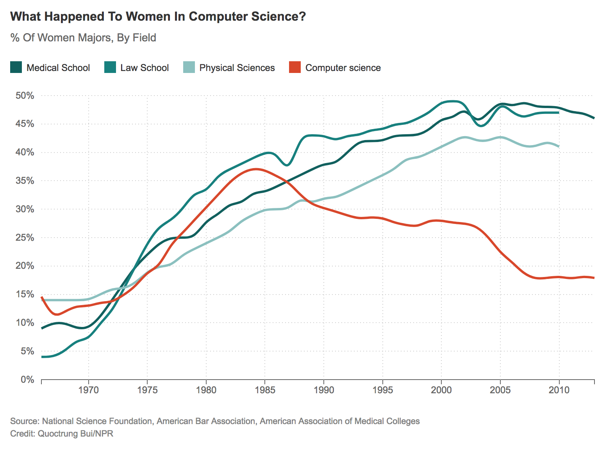

# Ethical data science

Data and information technology are powerful tools that can be used for good or evil. As with other human technologies (e.g. fossil fuel energy, nuclear technology) **the consequences of data science will depend on who uses it and for what purposes**. Much of humanity now relies on information technology in almost all aspects of our lives, and many data scientists are doing work that becomes part of this infrastructure. Like city planners, our decisions can have major impacts on everyone.

Data science can be directly harmful in ways that are easy to anticipate, but it can also do damage in ways that are subtle and more difficult to predict. The great diversity of people who may be affected by our work can make it challenging to anticipate all the potential harms, but making a thorough effort to do so is part of the responsibility of an ethical data scientist. Even if we are not particularly altruistic, we should also remember that blame for ethical failures typically does not fall on machines, but on the people who built or used them. For this reason it can be in our own best interests to avoid doing the kind of data science that brings about harm. 

"[First, do no harm](https://en.wikipedia.org/wiki/Primum_non_nocere)" is a phrase associated with medical ethics, and it's clearly relevant to data science as well. But as the phrase itself indicates, **avoiding harm is only the beginning**. A broader conception of ethics could include concern for freedom from the influence of data-driven decisions based on factors outside our control. Data science should be transparent and reproducible, qualities which are also desirable from the standpoint of scientific methodology. And statistical methods can only help us make sense of uncertainty if we use them in a principled and ethical fashion, otherwise we can end up deceiving ourselves and others.

The goal of this section (as with the rest of the book) is not to provide a list of principles or rules to memorize, but to motivate you to cultivate your own judgment and provide some starting points to help begin that process. Technology enables progress, but whether it is a software library for deep neural networks or something as simple as an abacus it can also encourage action without intention, decision without reflection. Your own internal sense of ethics may be our last line of defense in the basic human struggle for autonomy within the rapidly changing sociotechnical constraints of modernity. Your principled use of data science may be necessary to safeguard the epistemic autonomy of science from the financial pressures of the information economy.


## Motivating example: fair algorithms

There are many types of tasks in data science for which ethics is relevant, but we will continue focusing mainly on supervised learning. Suppose that we have data $(Y, X, A)$ where $Y$ is an *outcome variable*, $A$ is a *sensitive attribute* (e.g. racial and/or gender identity), and $X$ the remaining *predictors* which are considered nominally non-sensitive. We are tasked with learning a function to predict $Y$, that is we hope that
$$
Y \approx f(X, A) \quad \text{or (more realistically)} \quad E[Y|X, A] \approx f(X, A)
$$
for some function $f$ which we can estimate from a set of training data. However, since $A$ is a sensitive attribute, we would also like for the predictions from our learned function to "not depend" on $A$ in some sense. For example, we might consider functional independence:
$$
\hat Y = \hat f(X)
$$
where the function does not take $A$ as an explicit input. We'll come back to this later, but for now let's consider a few concrete examples of such a task to understand why we might want the predictions to "not depend" on $A$.

- Employment (ads): $Y$ is a score used to determine whether or not to interview or hire a candidate (or serve an ad for the position), $X$ some covariates like educational status and years of experience, and $A$ age or an indicator of whether someone is at least 40 years old. In the US, [it is illegal](https://en.wikipedia.org/wiki/Age_Discrimination_in_Employment_Act_of_1967) to discriminate in employment on the basis of age for people age 40 and above.
- Insurance/lending: $Y$ is a risk score used to price an insurance policy or loan decision, $X$ some covariates about employment status and financial credit history, and $A$ could be racial and/or gender identity. In 2019, Apple--one of the largest companies in the world and a veteran of the tech industry which employs many data scientists--released a credit card and caused an immediate scandal when people noticed that spending limits were drastically different between men and women, even for the [co-founder of Apple](https://www.wired.com/story/the-apple-card-didnt-see-genderand-thats-the-problem/) and his spouse.
- Criminal arrests: $Y$ indicates an outcome like arrest, the $X$ covariates might record past arrest history and age, and $A$ could be racial or religious identity. One underlying concern is that people are targeted by law enforcement differentially, resulting in different rates of arrest even if the underlying rates of criminal activity are not different. 

This list is not comprehensive and only meant to give some indication of the kinds of problems that might arise in fair algorithms. In each example, the past data $(Y, X, A)$ is used to learn a function $\hat f$ which predicts future outcomes from the covariates, and these predictions will be used to make decisions that affect people. But the past data may encode patterns due to historical injustices.

### A brief historical interlude

Let's consider the insurance/lending example and the history of oppression and violence in the United States toward African-Americans. Economic changes occur slowly, if at all, at the time scale of generations. The graphs below, created under the supervision of [W. E. B. Du Bois](https://en.wikipedia.org/wiki/W._E._B._Du_Bois) for [exhibition](https://www.smithsonianmag.com/history/first-time-together-and-color-book-displays-web-du-bois-visionary-infographics-180970826/) at the 1900 Exposition Universelle in Paris, show that after the end of centuries of slavery the accumulation of wealth among African Americans in the state of Georgia happened gradually, over decades, and was met with resistance. 

 

Before the 1960's civil rights movement, racist "[Jim Crow](https://en.wikipedia.org/wiki/Jim_Crow_laws)" laws continued to be obstacles to black Americans, and mass violence including riots resulted in deaths, destruction, and further setbacks. In one of the more extreme examples of this, in 1921 the wealthiest black community in the US (known as "[Black Wall Street](https://en.wikipedia.org/wiki/Tulsa_race_riot)") was attacked by thousands of white Americans who destroyed 35 blocks of homes, including with bombs dropped from airplanes, left about 10,000 black Americans homeless and killed on the order of a hundred people. 

It's not easy to find data on median family wealth by race going back before the 1980's, but a [recent paper](https://www.minneapolisfed.org/research/institute-working-papers/income-and-wealth-inequality-in-america-1949-2016) estimated this going back to almost 1950 and the result is [stark](https://qz.com/1368251/black-income-is-half-that-of-white-households-just-like-it-was-in-the-1950s/): 


Median family wealth for black families has remained low from the pre-civil rights era through to the present. This brief and very high level historical summary gives an idea of the context that our "training data" for a risk assessment algorithm comes from. There are many important details we have skipped, including the practices of "[redlining](https://en.wikipedia.org/wiki/Redlining)" and "[predatory](https://uncpress.org/book/9781469653662/race-for-profit/) [inclusion](https://www.nbcnews.com/think/opinion/undermining-black-homeownership-keeanga-yamahtta-taylor-podcast-transcript-ncna1063426)."

Switching to briefly consider the example of gender and employment, there has also been a slow and historically recent change in the fundamental relationships and conditions that generate the training data. Consider the labor force participation of women in the United States from about 1950 to the present:



Or, even more closely related to data science, consider the [percent of degrees](https://www.npr.org/sections/money/2014/10/21/357629765/when-women-stopped-coding) awarded to women in computer science in comparison to some other fields:


(Statistics does a little bit better than computer science in this regard).

Notice that I am appealing to empirical facts and data to make the case that some sort of adjustment may be necessary to make fair algorithms using training data from an unfair past. Do these facts seem relevant? What kinds of adjustments would be acceptable or desirable? How do we know what's fair or unfair to begin with? We'll now consider some principles and frameworks to help us answer questions like these, moving from the general to the more specific as we progress.

*Discussion*:

- Do you know of other examples like these where historical injustices can result in data showing poor outcomes for a particular group of people?
- Where do systems of [racial categorization](https://en.wikipedia.org/wiki/Historical_race_concepts) come from, and how have they [changed over time](https://www.pewsocialtrends.org/interactives/multiracial-timeline/)?
- Where does [gender identity](https://en.wikipedia.org/wiki/Social_construction_of_gender) come from, and is there any reason to [(dis)believe](https://chance.amstat.org/2014/11/visiphilia/) gender inherently relates to ability in computing or mathematics?

> The double-edged sword of data shows just how important it is to understand how structures of power and privilege operate in the world. The questions we might ask about these structures can relate to issues of gender in the workplace, [...]. Or they can relate to issues of broader social inequality, [...]. So one thing you will notice throughout this book is that not all of our examples are about women--and deliberately so. This is because data feminism is about more than women. It's is about more than gender. Put simply: Data Feminism is a book about power in data science. Because feminism, ultimately, is about power too. It is about who has power and who doesn’t, about the consequences of those power differentials, and how those power differentials can be challenged and changed.

From [Data Feminism](https://bookbook.pubpub.org/pub/dgv16l22) by Catherine D’Ignazio and Lauren Klein

## Philosophy of ethics

### Meta-ethics

Meta-ethics is about high level questions like:

- Can moral statements be factual, or are they just expressions of taste/preference?
- Are morals universal, relative, or meaningless?
- What approaches can be used to establish moral claims? Can we rely on intuition, reason, empirical evidence?

Although these are fascinating questions we will not dwell on them. We'll proceed under a working assumption that (1) moral claims are meaningful (and important) enough to merit our careful study, and (2) the above methods for establishing them are all valid enough to use but also imperfect and subject to error. We can also remember to reconsider these questions in light of the concepts and examples we focus on below.

### Normative ethics 

There are a variety of qualitatively different theoretical approaches for how we can determine what is ethical or moral. These approaches are not mutually exclusive or exhaustive, so we do not have to choose one of them or limit our thinking to using only these ideas.

#### Consequentialist ethics

Consequentialism judges actions based on effects caused by those acts. One common form of this is **utilitarianism**: to choose actions resulting in the greatest good for the greatest number of people. There are difficulties in defining utility, trading off between different people, deciding whether to judge specific acts or general rules for guiding actions, and uncertainty about predicting consequences. The last issue, predicting consequences, is one where the intersection with data science is particularly relevant.

#### Deontological ethics

Deontology judges actions without necessarily referencing the effects caused by these actions. Actions can be considered good even if they result in bad consequences as long as they adhere to moral rules. Provided we understand which rules we have a duty to follow this may be simpler than consequentialism because we may not need to predict the consequences of our actions. However, if there is no room to override rules under special circumstances we may be obligated to suffer extremely bad consequences.

#### Virtue ethics

Virtue ethics judges traits, or character. A person can be moral even if they act against deontological rules and their action causes negative consequences, provided the person acts in accordance with a virtuous trait. Upholding virtues is considered a good in itself, and some virtues emphasize the social aspects of being morally good. With a multiplicity of virtues rather than one sense of good we may have better explanatory power, but conflicts can arise between virtues and we may not agree on which character traits should be considered virtuous.


*Discussion*:

- Data science is usually framed (perhaps implicitly) as utilitarian because of its focus on prediction/causation (consequences) and optimization (utility). Discuss some prototypical data science problems with explicitly utilitarian language, and indicate how non-consequentialist theories can also apply to these problems.
- Deontology seems to most obviously relate to “equal treatment” notions of fairness, but (1) can other fairness notions be justified on a deontological basis, (2) how would other ethical theories justify/criticize equal treatment?
- How do we know/decide which things are virtuous? Is intelligence a virtue? How/when can we decide between contradicting virtues?
- For each of the previous normative frameworks, use that framework to describe an argument (1) supporting the practice of following laws, and (2) supporting the practice of law-breaking under certain circumstances, and describe sufficient properties of those circumstances.


## Applied ethics

Applied ethics in data science is the most relevant part of this topic to our course. Normative ethical theories can be valuable for high level reasoning, but may be too general to figure out what is good in a specific real world scenario. To address this practical problem, professionals in fields like biomedical ethics have developed principles that may also be broadly applicable in data science.

### Belmont-Menlo principles

Starting in 1932 the United States Public Health Service carried out a study--the [Tuskegee syphilis experiment](https://en.wikipedia.org/wiki/Tuskegee_syphilis_experiment)--that recruited African American men in the state of Alabama by telling them that they would receive free healthcare. Most of the men in the study had a disease, syphilis, but were never told by the researchers that they had the disease, and were also never told that they were not actually being treated. By 1947 it was well known that the drug penicillin was an effective treatment, but the study participants were prevented from receiving this treatment. Other researchers who knew of the study raised objections, including one doctor who wrote to the study authors in 1965 but was ignored. The US Centers for Disease Control intended to continue the study until all participants had died. In 1968 [William Carter Jenkins](https://www.nature.com/articles/d41586-019-00900-9), an African American statistician, founded and wrote a newsletter where he also tried to raise awareness of the experiment. Another whistleblower came forward in 1972 and finally some major newspapers picked up the story and the study was ended. By that time some of the men had died of syphilis or related complications, some of their wives had become infected, and some of their children were born with syphilis. Jenkins produced [a documentary](https://youtu.be/3e5VfgsGp1k) interviewing survivors of the experiment in 2002 when some of them were still alive. 

Under national attention the study became a scandal, and in response the government formed a National Commission for the Protection of Human Subjects of Biomedical and Behavioral Research. The Commission spent several years authoring a report, commonly referred to as the [Belmont Report](https://en.wikipedia.org/wiki/Belmont_Report), which established 3 of the 4 principles listed below. This report still guides the Institutional Review Boards (IRB) that oversee compliance with ethical research practices in many universities.

These principles were adapted and supplemented by the US Department of Homeland Security Science and Technology Directorate into a cybersecurity setting. Their [Menlo Report](https://www.dhs.gov/sites/default/files/publications/CSD-MenloPrinciplesCORE-20120803_1.pdf) was published in 2012 and describes the four principles which are copied verbatim below:

#### Respect for persons

> Participation as a research subject is voluntary, and follows from  informed  consent; Treat individuals as autonomous agents and respect their right to determine their own best interests; Respect individuals who are not targets of research yet are  impacted; Individuals with diminished  autonomy, who are incapable of deciding for themselves, are entitled to protection.

#### Beneficience

> Do  not  harm;  Maximize  probable  benefits  and  minimize probable harms; Systematically assess both risk of harm and benefit.

#### Justice

> Each  person  deserves  equal  consideration  in  how  to  be treated,  and  the  benefits  of  research  should  be  fairly  distributed  according  to  individual  need,  effort,  societal  contribution, and merit; Selection of subjects should be fair, and burdens should be allocated equitably across impacted subjects.

#### Respect for law and the public interest

> Engage in legal due diligence; Be transparent in methods and results; Be accountable for actions.

### The five Cs framework

In the book Ethics in Data Science by Mike Loukides, Hilary Mason, and DJ Patil, the authors outline a practical framework they call the [five Cs](https://resources.oreilly.com/examples/0636920203964/blob/master/the_five_cs.md) which we now summarize.

#### Consent

We should not collect data from people who have not explicitly agreed to allow that data collection. Informed consent is also part of the Belmont principle of respect for persons. To be informed means that people know what data will be collected and what purposes it may be used for, and can reasonably understand the consequences of their agreement to allow data collection. Obtaining informed consent is practically mandatory for medical research, but sadly it remains an uncommon standard regarding data collection. There are many companies that collect data about people without even asking.

#### Clarity

To give informed consent someone must understand what their consent allows. But user agreements are often hard to understand, even for relatively well informed people, and the consequences of allowing data collection are far from well understood by most of the people checking the "I agree" box in order to continue. 

#### Consistency and trust

Being consistent helps people set their expectations and decide whether to trust our work. Many of the examples where data science has resulted in undesirable outcomes generating a lot of controversy happened because people encountered some behavior or outcome inconsistent with their expectations. 

#### Control and transparency

After giving informed consent for their data to be collected, users should still have control. This requires ongoing transparency about the status of their data, and should allow users to opt in or out of specific uses if they choose to do so even after initially giving consent.

#### Consequences

We should take extra care to anticipate unintended consequences of the existence of some kinds of data. Some people, like children, and some especially sensitive kinds of data, like genomic sequence data, may require special protections and additional security. There is often a great danger in the combination of data from different sources to de-anonymize individuals.

### Ethical Guidelines for Statistical Practice

This set of guidelines produced by the Committee on Professional Ethics of the American Statistical Association is especially relevant to data scientists. We hightlight a few sections below, but the guidelines are [worth reading in full](https://www.amstat.org/ASA/Your-Career/Ethical-Guidelines-for-Statistical-Practice.aspx), including all of the subsections.

> The ethical statistician uses methodology and data that are relevant and appropriate; without favoritism or prejudice; and in a manner intended to produce valid, interpretable, and reproducible results. The ethical statistician does not knowingly accept work for which he/she is not sufficiently qualified, is honest with the client about any limitation of expertise, and consults other statisticians when necessary or in doubt. It is essential that statisticians treat others with respect. 

> [...] Identifies and mitigates any preferences on the part of the investigators or data providers that might predetermine or influence the analyses/results. 

> [...] Where appropriate, addresses potential confounding variables not included in the study.

> [...] When reporting analyses of volunteer data or other data that may not be representative of a defined population, includes appropriate disclaimers and, if used, appropriate weighting.

> Those employing any person to analyze data are implicitly relying on the profession’s reputation for objectivity. However, this creates an obligation on the part of the employer to understand and respect statisticians’ obligation of objectivity. 


## Causality and ethics

Causal understanding is necessary to apply consequentialism. An observational model of the world does not tell us what consequences we can expect to result from any action which is an intervention. For example, [observational data shows](https://rss.onlinelibrary.wiley.com/doi/abs/10.1111/j.1467-985X.2006.00403.x) that divorcing couples are significantly happier after getting divorced. Does this mean, from a utilitarian perspective, that everyone who can should get divorced? No, because the characteristics of couples who divorced may not be representative of all couples. In fact we can reasonably assume that couples who divorce are unhappy with their relationships, and that might not be true about all married couples!

For similar reasons, causal understanding can help us decide whether certain rules are good from a deontological perspective. Consider Immanuel Kant's **categorical imperative**:

> Act only according to that maxim whereby you can, at the same time, will that it should become a universal law.

Our causal understanding of the previous example allows us to understand that we would (probably) not wish either mandatory marriage or mandatory divorce to be universal laws. In deciding which things we would like to be universal laws we need to think about counterfactuals--what would happen if everyone was obliged to follow this law?

Causal understanding may also help illuminate virtues. Consider one of the classic examples of a vice: gluttony, or over-consumption. Research in medical sciences have revealed causal mechanisms driving appetite, for example we now know that [stress](https://www.health.harvard.edu/staying-healthy/stress-and-overeating) can increase appetite and cravings for fat and sweet foods. Hence, if we wish to promote the virtue of moderation we may be able to do so by taking steps to reduce stress.

### Causal models

The directed acyclic graph and structural equation modeling (DAG-SEM) framework for causal models provides a useful kind of notation for reasoning through ethical questions in data science. To illustrate this, let's return to the fair algorithms example, and consider a specific instance where we assume the world can be adequately represented by the graph below.

```{r echo = FALSE}
library(DiagrammeR)
mermaid(
  "graph TB;
  A[Gender]-->X[Car Color]
  U(Aggression)-->X
  U-->Y[Risk]"
)
```

In this task a car insurance company wants to predict the risk of an insurance policy $Y$, and the only data available to them is the car color $X$ and the gender $A$ of the policy holder. The aggression variable is an unobserved confounder. Aggression is responsible for an observed association between $X$ and $Y$.

Recall the functional independence version of fairness, where we train a function $\hat f = \hat f(X)$ that does not take $A$ as an input. We can now use the causal model to understand the consequences of this type of fairness.

Let's generate some synthetic data from this model with specific choices for the structural equations:

```{r}
A <- rbinom(100, 1, .5)
U <- rnorm(100)
X <- A + U > 1
Y <- U > 1/2
world <- data.frame(Gender = factor(c("Other", "Woman")[as.numeric(A)+1]),
                    CarColor = factor(c("Silver", "Red")[as.numeric(X)+1]),
                    Aggressiveness = U,
                    HighRisk = Y)
head(world)
```

We can see there is no association between gender and aggressiveness:

```{r message = FALSE}
library(tidyverse)
ggplot(world, aes(Gender, Aggressiveness)) + geom_boxplot() + theme_minimal()
```

But there is an association between car color and aggressiveness:

```{r}
ggplot(world, aes(CarColor, Aggressiveness)) + geom_boxplot() + theme_minimal()
```

Let's fit the functionally independent model, in this case using logistic regression to predict the log odds of a binary outcome, and see how such a model performs in predicting high risk status

```{r}
library(knitr)
nominal_model <- glm(HighRisk ~ CarColor, family = binomial, data = world)
world$predicted <- predict(nominal_model, type = "response") > mean(world$HighRisk)
world %>% group_by(Gender, HighRisk) %>%
  summarize(Predicted = mean(predicted)) %>%
  kable()
```

Even though there is no assocation between gender and aggression in this world, the model misclassifies many low risk women as high risk and many high risk men as low risk. In the US, consequences like this could result in legal risk in some settings due to a legal theory called [disparate impact](https://en.wikipedia.org/wiki/Disparate_impact). But there may be a deontological argument in favor of functional independence, including [empirical evidence](http://www.mlandthelaw.org/papers/grgic.pdf) that people generally believe a process with functional independence is more fair.

#### Counterfactual fairness

With a mathematical causal model we can ask and answer counterfactual questions like "what would be the predicted risk for this person if they were a different gender?" The model tells us that with a different gender, that individual might have also had a different car color, because car color is causally influenced by gender in this world. Hence, even though the functionally independent model does not take $A$ as an explicit input, it might have given a different counterfactual prediction to a differently gendered version of the individual in question. 

We can take this further by defining fairness in terms of our model-based counterfactuals. Let's call the learned function $\hat f$ **counterfactually fair** if it gives the same predictions to each indivudal and the counterfactual version of that individual with a different gender. This may be a very strong condition depending on the causal model.

One drawback to this approach is that for many kinds of sensitive attributes, like racial and gender identity, it can be difficult to relate mathematical model-based counterfactuals to the real world. The meaning of such counterfactuals is subject to an [ongoing](https://www.ncbi.nlm.nih.gov/pmc/articles/PMC4125322/) [debate](https://scholar.harvard.edu/files/msen/files/race_causality.pdf) across [scholarly](http://www.ets.org/Media/Research/pdf/RR-03-03-Holland.pdf) [disciplines](https://papers.ssrn.com/sol3/papers.cfm?abstract_id=3050650). We now consider a brief and high level summary of this debate.

There is an argument that it only makes sense to speak of variables being causes if those variables could be manipulated or controlled in an experimental setting. As an example we can refer to [randomized experiments](https://www.pnas.org/content/109/41/16474.short) evaluating biases in the evaluation of applicants to jobs or academic programs by randomizing the names on applications. Names can be thought of as a **proxy** for the sensitive attribute in the sense that the person judging an application might infer a gender or racial identity of the applicant based on the name. I consider this a **shallow counterfactual**: what would the decision be if this person had a different name on their application, but everything else in their life until this point had otherwise been the same? In contrast, a **deep counterfactual** would ask how the decision might be different if the person had had a different name for their entire life, implying that possibly other aspects of their application might be different aside from their name. Proxy counterfactuals are not only shallow, they also fail to capture what other types of things might be different in the deep counterfactual where not only the proxy was changed but other aspects of racial or gender identity had also been changed. Finally, another possible position in this debate argues for counterfactual versions of our world without the structural factors that caused disparities in the first place. For example, how might this person's life and the data we have for them have been different if their ancestors had not been enslaved, subjected to racist Jim Crow laws and redlining, and had not been deprived of generations worth of accumulation of wealth?

### Moral luck

We conclude by considering another helpful concept in normative ethics which is closely related to causation. Moral luck refers to how our evaluation of whether someone has done good or not can depend on factors which are outside of that person's control. The **control principle** says that we should only judge people to the extent that the factors we judge them on are under their control.

The control principle provides one justification for why we consider attributes like racial or gender identity to be "sensitive attributes" in algorithmic fairness in the first place, and why we have laws to protect people from discrimination on the basis of these attributes in certain places and contexts. Such attributes are commonly understood to be out of our individual control.

Strict application of this principle can have some dramatic and unintuitive implications, and there are subtleties related to defining control (or autonomy, agency, free will, etc) and deciding which things we have control over. But the concept, combined with statistical understanding of uncertainty and randomness, can help us arrive at reasonable expectations and standards for moral behavior. 

#### Path-specific counterfactual fairness

Motivation for path specific fairness: some pathways may be considered to be within our control.

Counterfactual fairness can be refined to versions where some pathways of causation in the model are considered unfair and others are considered fair. We can then ask for an algorithm to be counterfactually fair when computing counterfactuals while blocking the fair pathways, thus only requiring invariance with respect to changes that propagate along the unfair pathways. As one possible example, consider a predictive policing algorithm that dispatches police to patrol locations based on historical arrest data. Due to redlining, we observe racial disparities in neighborhood demographics, and historically there were higher rates of policing in majority-minority neighborhoods and therefore higher rates of arrests. We summarize this hypothetical world in the graph below:

```{r echo = FALSE}
mermaid(
  "graph TB;
  A[Race]-->X[Neighborhood]
  X-->U[Prior Arrests]
  U-->Y[Future Arrests]
  X-->Y"
)
```

One possible application of path-specific fairness in this graph is as follows. We wish to avoid predicting higher rates of arrests on the basis of race, and since we know that race has historically influenced which neighborhood someone lives in we understand that we cannot simply predict using the neighborhood variable without potentially having a disparate impact. However, someone may argue that the pathway $\text{Prior Arrests} \to \text{Future Arrests}$ should be considered fair based on the assumption that avoiding behavior that might result in arrest is within a person's control. Someone else may argue that this pathway is still unfair because being arrested is still at least partially a matter of luck. It's not in an individual's control to decide what level of policing their neighborhood is subjected to, and it's unfair that people behaving in ways that could result in arrest in other neighborhoods are not arrested simply because they were not caught.

## Conclusion

Taken together, the growing body of empirical research that can help us understand real world causes, mathematical causal models, definitions of fairness using counterfactuals and path-specific counterfactuals, and a variety of normative ethical frameworks provide us with a powerful set of tools for understanding the ethical implications of a given data science task. There are still challenges, especially regarding modeling choices which will almost always rely on some assumptions that are not testable. In some scenarios we may not be able to arrive at a consensus on one adequate causal model or one set of choices regarding which pathways in a given model are fair. But we can at least have a common framework in which to have those discussions, the framework directs our attention toward causal relationships, and it allows/forces us to make our assumptions explicit and transparent. Even in settings when we cannot reach consensus, if we can arrive at a small enough set of models which are not too mutually contradictory, we can use [algorithmic methods](https://papers.nips.cc/paper/7220-when-worlds-collide-integrating-different-counterfactual-assumptions-in-fairness) to approximately satisfy counterfactual fairness simultaneously for each model.

Finally, even if we are not fully committed to causal approaches to fairness or ethics in the sense that we will derive our actual actions from them, we can still use them as thought experiments and diagnostic methods. They can help us to understand the limitations of other methods, identify ethically sensitive aspects of the data science task, and even find ways to intervene or change the task formulation.

## Additional reading

General data science ethics

- **Statement**: [Ethical Guidelines for Statistical Practice](https://www.amstat.org/ASA/Your-Career/Ethical-Guidelines-for-Statistical-Practice.aspx) by the American Statistical Association
- Statement: [Code of Ethics and Professional Conduct](https://www.acm.org/code-of-ethics) by the Association for Computing Machinery
- Statement: [Data Ethics Framework](https://www.gov.uk/government/publications/data-ethics-framework/data-ethics-framework) by the UK Government
- Short book: [Ethics and Data Science](https://resources.oreilly.com/examples/0636920203964) by Mike Loukides, Hilary Mason, and DJ Patil (Patil was Chief Data Scientist during the Obama administration)
- Book: [Data Feminism](https://bookbook.pubpub.org/data-feminism) by Catherine D’Ignazio and Lauren Klein
- Book: [Indigenous Data Sovereignty ](https://press.anu.edu.au/publications/series/caepr/indigenous-data-sovereignty) edited by Tahu Kukutai and John Taylor
- **Book**: [Bit by Bit (Ethics Chapter)](https://www.bitbybitbook.com/en/ethics/) by Matthew Salganik
- Case studies: [Collection of fictional case studies](https://aiethics.princeton.edu/case-studies/case-study-pdfs/) by the Princeton Dialogues on AI and Ethics

Fairness and causal models

- Articles: [Disparate](https://phenomenalworld.org/digital-ethics/disparate-causes-i) [Causes](https://phenomenalworld.org/digital-ethics/disparate-causes-pt-ii) by Lily Hu
- Paper: [Causal Reasoning for Algorithmic Fairness](https://arxiv.org/abs/1805.05859) by Joshua Loftus, Chris Russell, Matt  Kusner, and Ricardo Silva

Stanford Encyclopedia of Philosophy

- [Informed Consent](https://plato.stanford.edu/archives/spr2019/entries/informed-consent/) by Nir Eyal
- [Computer and Information Ethics](https://plato.stanford.edu/archives/sum2018/entries/ethics-computer/) by Terrell Bynum
- [Social Networking and Ethics](https://plato.stanford.edu/entries/ethics-social-networking/) by Shannon Vallor
- [Search Engines and Ethics](https://plato.stanford.edu/archives/fall2016/entries/ethics-search/) by Herman Tavani
- [Business Ethics](https://plato.stanford.edu/archives/fall2017/entries/ethics-business/) by Jeffrey Moriarty

